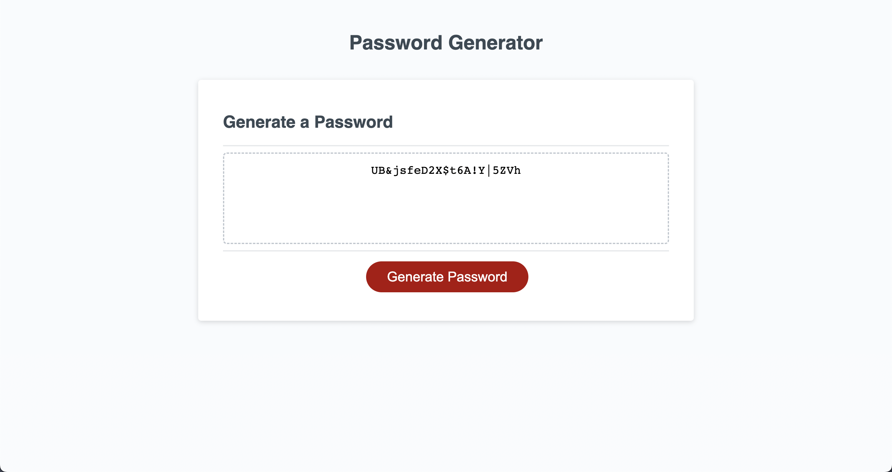

# Password Generator Starter Code
A password generator built in Javascript to provide secure passwords.

## Usage
The generate password button can be clicked to trigger a prompt, which will ask the user how many characters they would like to include in their password. The password will contain numbers, UpperCase letters, and LowerCase letters.

## Link

https://darthcurtiscass.github.io/DCC-password-generator/

## Screenshot

## License

N/A